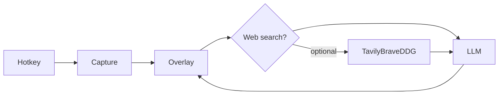

# clAIre

A lightweight, cross-platform desktop assistant. Press a global hotkey and clAIre captures the current window without first stealing focus, then overlays a small query bar. Sending a question, opening Settings, or picking windows grows that same frameless window to fit the content. Its size stays pinned to that content. The screenshot is attached as vision context and, when web search is on, the query is searched before it is sent to the LLM you configure.

clAIre lives in the system tray. Hiding the overlay leaves the process running; Quit from the tray icon exits.

## Requirements

- **Node.js** 18+
- **Rust** 1.77.2+ via [rustup](https://rustup.rs/)
- Platform build dependencies (see below)

### Linux (Debian/Ubuntu/Mint)

```bash
sudo apt install -y \
  libwebkit2gtk-4.1-dev build-essential curl wget file \
  libxdo-dev libssl-dev libayatana-appindicator3-dev librsvg2-dev \
  libgtk-3-dev pkg-config libclang-dev libxcb1-dev libxrandr-dev \
  libdbus-1-dev libpipewire-0.3-dev libwayland-dev libegl-dev libgbm-dev
```

Screen capture uses X11 most reliably (Cinnamon on X11 is supported). Wayland capture is best-effort through `xcap`.

API keys are stored in the system credential store (Secret Service: GNOME Keyring or KWallet). Install and unlock one of those before saving a key. `gnome-keyring` is already part of a normal Cinnamon session.

### macOS

Install Xcode Command Line Tools. Grant **Screen Recording** and **Accessibility** permissions to clAIre (or the Terminal app while developing) so global hotkeys and screenshots work.

### Windows

Install [WebView2](https://developer.microsoft.com/en-us/microsoft-edge/webview2/) (bundled on recent Windows 10/11) and the MSVC build tools used by Rust.

## Setup

```bash
# 1. Rust toolchain (once per machine)
curl --proto '=https' --tlsv1.2 -sSf https://sh.rustup.rs | sh
source "$HOME/.cargo/env"

# 2. Frontend deps
npm install

# 3. Icons (already generated; re-run if you change scripts/gen_icons.py)
python3 scripts/gen_icons.py

# 4. Development
npm run tauri dev
```

The first compile downloads Rust crates and can take several minutes. After that, clAIre stays in the tray until you press the hotkey or use the tray menu.

### Production bundle

```bash
npm run tauri build
```

Installers are written to `src-tauri/target/release/bundle/` (`.deb` / AppImage on Linux, `.dmg` / `.app` on macOS, `.msi` / `.exe` on Windows).

## First-run flow

1. Start clAIre. A tray icon appears; no window is shown.
2. Open **Settings** from the tray. That opens the settings view in the overlay.
3. Choose a provider and paste credentials. Defaults are `gpt-5.4-mini` (OpenAI) and `claude-sonnet-5` (Anthropic).
   - **OpenAI** — API key, model, optional base URL
   - **Anthropic** — API key and Claude model
   - **Google Gemini, Groq, OpenRouter, Mistral, DeepSeek, xAI, Together, Fireworks** — API key and a model for that host (OpenAI-compatible)
   - **Ollama** — local endpoint (`http://127.0.0.1:11434`) and a model such as `llava`
   - **Custom** — any OpenAI-compatible `/v1/chat/completions` server
4. Optional: enable **Web search** (Tavily, Brave, or DuckDuckGo). DuckDuckGo does not need an API key.
5. Set the global hotkey (default `Ctrl/Cmd+Shift+Space`). On the overlay, choose no window, the current window, or several windows. The hotkey always starts on the current window. Saving Settings keeps whichever capture mode is already active.
6. Save. Press the hotkey: clAIre captures first, then focuses the overlay.

A `.env` file next to the project (or the same variables in the environment) is applied on every launch, including over saved settings:

| Variable | Effect |
| --- | --- |
| `API_KEY` or `GEMINI_API_KEY` | Switch the provider to Gemini and use `gemini-2.5-flash` |
| `TAVILY_API_KEY` | Tavily key; turns web search on |
| `BRAVE_API_KEY` | Brave key; turns web search on |
| `API_KEY_SEARCH` | Tavily if it starts with `tvly-` or `SEARCH_PROVIDER=tavily`. Brave if `SEARCH_PROVIDER=brave`, or if neither `TAVILY_API_KEY` nor `BRAVE_API_KEY` is set. Unused when `SEARCH_PROVIDER` is DuckDuckGo |
| `SEARCH_PROVIDER` | `tavily`, `brave`, or `duckduckgo` / `ddg`. DuckDuckGo turns web search on without a key |

API keys are stored in the operating system credential store, not in `settings.json`:

| Platform | Store |
| --- | --- |
| Linux | Secret Service (GNOME Keyring or KWallet) |
| macOS | Keychain |
| Windows | Credential Manager |

`settings.json` keeps the rest of the configuration and is mode `0600` on Unix. Search usage is keyed by a SHA-256 id, not the key itself. Keys are never committed to the repo. An existing `settings.json` that still contains keys is migrated into the credential store on the next launch, then rewritten without those keys.

## Interaction

| Action | Result |
| --- | --- |
| Global hotkey | Capture the current window, then show the compact ask bar (always on top, not in the taskbar). Press again to hide and clear the chat. |
| Enter | Send the query. The same frameless window grows to fit the thread. |
| Shift+Enter | Newline |
| Esc | Hide to the tray and clear the chat. Closes an open screenshot preview or the settings view first. |
| Hide (–) or the window close button | Hide to the tray and clear the chat. The process keeps running. |
| Settings | Settings view inside the overlay. The window grows to fit it. |
| Multiple windows | Pick windows to capture. The list refreshes about every 1.5 seconds while that mode is open. |
| **New chat** | Clear the thread and keep the current screenshot. |
| **Clear context** | Wipe the thread and delete `context/` (screenshot and session). |
| Tray → Settings | Open the expanded overlay on the settings view. That raise lists the window in the taskbar and turns always-on-top off. |

If a capture exists, its PNG is attached for every provider. A text-only model may ignore the image. Web search, when enabled and the overlay Web switch is on, runs before the LLM call and is prepended to the prompt. A search failure is shown and the question is still sent without search results. A second launch is handed to the running app, which recaptures the current window and shows the overlay.

## Storage

| Platform | App data |
| --- | --- |
| Linux | `~/.local/share/com.claire.desktop/` |
| macOS | `~/Library/Application Support/com.claire.desktop/` |
| Windows | `%APPDATA%\com.claire.desktop\` |

```
settings.json          Hotkey, models, capture mode, search limits (API key fields are empty)
context/session.json   Chat turns, a running summary, total turn count, and an epoch
context/latest.png     Last screenshot
context/latest.json    Width, height, time, and capture mode for that screenshot
```

The chat sent to the model is capped by the history limit (default 6). After more turns than that, the saved summary is included so later replies can still use earlier facts. Search usage is counted per API key under a SHA-256 id and is written to `settings.json` about 1.5 seconds after a search. **Clear context** deletes `context/` immediately from both the overlay and the tray. Hiding the overlay clears the chat and leaves the screenshot files in place.

## Project layout

```
src/overlay/                 Ask bar, chat, and capture controls (Vite + React)
src/settings/                Settings view rendered inside the overlay
src/shared/                  IPC types, provider lists, and API wrappers
src-tauri/src/capture.rs     Screenshot and window listing (xcap, plus X11 on Linux)
src-tauri/src/capture_flow.rs  Capture, then show or update the overlay
src-tauri/src/linux_windows.rs Extra Linux window lists (AT-SPI, Hyprland, Sway, niri)
src-tauri/src/linux_a11y.rs  AT-SPI helpers for Wayland window frames
src-tauri/src/commands.rs    Tauri commands (ask, capture, settings, window)
src-tauri/src/hotkey.rs      Global shortcut registration
src-tauri/src/tray.rs        Background tray persistence
src-tauri/src/llm.rs         Streaming chat clients (Anthropic, Ollama, OpenAI-compatible)
src-tauri/src/search.rs      Optional Tavily / Brave / DuckDuckGo augmentation
src-tauri/src/secrets.rs     OS credential store and key migration
src-tauri/src/settings.rs    Settings model and search usage
src-tauri/src/storage.rs     App-data session, screenshot, and wipe
src-tauri/src/state.rs       In-memory settings, session, and latest capture
src-tauri/src/specs.rs       OS, CPU, memory, and hostname sent with each chat request
```



## Scripts

| Command | Purpose |
| --- | --- |
| `npm run tauri dev` | Dev overlay + Rust backend |
| `npm run tauri build` | Platform installer |
| `npm run build` | Frontend only |
| `npm test` | Frontend unit tests |
| `npm run lint` | ESLint |
| `npm run icons` | Regenerate tray/app icons (`scripts/gen_icons.py`) |

Pull requests and pushes to `main` run GitHub Actions: `npm test`, ESLint, `npm run build`, `cargo fmt`, Clippy, `cargo test`, and installer builds on Linux, macOS, and Windows. Pushing a `v*` tag (for example `v0.1.0`) builds `.deb`, `.AppImage`, `.dmg`, `.msi`, and `.exe` and attaches them to a draft GitHub Release. Publish that draft after checking the assets.

macOS builds are ad-hoc signed unless these repository secrets are set: `APPLE_CERTIFICATE`, `APPLE_CERTIFICATE_PASSWORD`, and `APPLE_SIGNING_IDENTITY`. Notarization also uses `APPLE_ID`, `APPLE_PASSWORD`, and `APPLE_TEAM_ID`. Windows Authenticode uses `WINDOWS_CERTIFICATE` and `WINDOWS_CERTIFICATE_PASSWORD` when those secrets exist.

## Notes

- Use a **vision-capable** model if you want the screenshot to matter (`gpt-5.4-mini`, `claude-sonnet-5`, `llava`, …). The image is still attached for other models; they may ignore it. The query, any search results, and a short machine description (OS, CPU, memory, hostname) are sent either way.
- If the hotkey does not fire, it is likely claimed by the desktop environment. Record a different chord in Settings.
- macOS will prompt for screen-recording permission on the first capture.

## Contributing

See [CONTRIBUTING.md](CONTRIBUTING.md) for the build setup, checks, and pull requests. Community expectations are in the [Code of Conduct](CODE_OF_CONDUCT.md).

## License & Privacy

This project is open-source under the [MIT License](LICENSE).
Read our [Privacy Policy](PRIVACY.md) to learn how local data and screenshots are handled.
