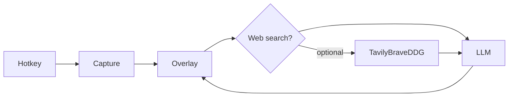

# clAIre

A lightweight, cross-platform desktop assistant. Press a global hotkey, clAIre captures the screen (or the active window) without first stealing focus, then overlays a small query bar. After you send a question — or open Settings / pick windows — the bar promotes into a normal resizable window. The screenshot is attached as vision context and optionally augmented with web search before it is sent to the LLM you configure.

clAIre lives in the system tray. Closing the overlay or settings window hides it; Quit from the tray icon exits.

## Requirements

- **Node.js** 18+
- **Rust** 1.77.2+ via [rustup](https://rustup.rs/)
- Platform build dependencies (see below)

### Linux (Debian/Ubuntu/Mint)

```bash
sudo apt install -y \
  libwebkit2gtk-4.1-dev build-essential curl wget file \
  libxdo-dev libssl-dev libayatana-appindicator3-dev librsvg2-dev \
  libgtk-3-dev pkg-config libclang-dev libxcb1-dev libxrandr-dev \
  libdbus-1-dev libpipewire-0.3-dev libwayland-dev libegl-dev libgbm-dev
```

Screen capture uses X11 most reliably (Cinnamon on X11 is supported). Wayland capture is best-effort through `xcap`.

### macOS

Install Xcode Command Line Tools. Grant **Screen Recording** and **Accessibility** permissions to clAIre (or the Terminal app while developing) so global hotkeys and screenshots work.

### Windows

Install [WebView2](https://developer.microsoft.com/en-us/microsoft-edge/webview2/) (bundled on recent Windows 10/11) and the MSVC build tools used by Rust.

## Setup

```bash
# 1. Rust toolchain (once per machine)
curl --proto '=https' --tlsv1.2 -sSf https://sh.rustup.rs | sh
source "$HOME/.cargo/env"

# 2. Frontend deps
npm install

# 3. Icons (already generated; re-run if you change scripts/gen_icons.py)
python3 scripts/gen_icons.py

# 4. Development
npm run tauri dev
```

The first compile downloads Rust crates and can take several minutes. After that, clAIre stays in the tray until you press the hotkey or use the tray menu.

### Production bundle

```bash
npm run tauri build
```

Installers are written to `src-tauri/target/release/bundle/` (`.deb` / AppImage on Linux, `.dmg` / `.app` on macOS, `.msi` / `.exe` on Windows).

## First-run flow

1. Start clAIre. A tray icon appears; no window is shown.
2. Open **Settings** from the tray.
3. Choose a provider and paste credentials:
   - **OpenAI** — API key, model (`gpt-4o-mini`, `gpt-4o`, …), optional custom base URL
   - **Anthropic** — API key and Claude model
   - **Ollama** — local endpoint (`http://127.0.0.1:11434`) and a vision model such as `llava`
   - **Custom** — any OpenAI-compatible `/v1/chat/completions` server
4. Optional: enable **Web search** (Tavily, Brave, or DuckDuckGo). For local testing, `API_KEY_SEARCH` / `TAVILY_API_KEY` / `BRAVE_API_KEY` in `.env` are applied like `API_KEY`.
5. Set the global hotkey (default `Ctrl/Cmd+Shift+Space`) and capture target (primary display, all displays, or active window).
6. Save. Press the hotkey: clAIre captures first, then focuses the overlay.

API keys are stored only in the OS app-data directory (`settings.json`, mode `0600` on Unix). They are never committed to the repo.

## Interaction

| Action | Result |
| --- | --- |
| Global hotkey | Capture first, then show the compact ask bar. Press again to hide. |
| Enter | Send the query with the current screenshot and expand into the chat window |
| Shift+Enter | Newline |
| Esc | Hide to the tray (clears the session) |
| Settings / Windows | Promote to the full window |
| Minimize (expanded) | Keep the thread in the taskbar |
| **Clear context** | Wipe session history and stored screenshots |
| Tray → Settings | Provider, search, hotkey, storage |

Vision is used whenever a capture exists and the configured model accepts images. Web search, when enabled, runs before the LLM call and is prepended to the prompt.

## Storage

| Platform | App data |
| --- | --- |
| Linux | `~/.local/share/com.claire.desktop/` |
| macOS | `~/Library/Application Support/com.claire.desktop/` |
| Windows | `%APPDATA%\com.claire.desktop\` |

```
settings.json          LLM keys, hotkey, capture mode
context/session.json   Recent conversation turns (capped)
context/latest.png     Last screenshot
```

Runtime memory only holds the current settings, the last screenshot, and the in-session history. **Clear context** deletes `context/` immediately from both the overlay and Settings.

## Project layout

```
src/overlay/           Quick-ask overlay (Vite + React)
src/settings/          Settings window
src/shared/            IPC types and API wrappers
src-tauri/src/capture.rs   Cross-platform screenshot (xcap)
src-tauri/src/hotkey.rs    Global shortcut registration
src-tauri/src/tray.rs      Background tray persistence
src-tauri/src/llm.rs       OpenAI / Anthropic / Ollama / custom vision clients
src-tauri/src/search.rs    Optional Tavily / Brave / DuckDuckGo augmentation
src-tauri/src/storage.rs   App-data session + wipe
```



## Scripts

| Command | Purpose |
| --- | --- |
| `npm run tauri dev` | Dev overlay + Rust backend |
| `npm run tauri build` | Platform installer |
| `npm run build` | Frontend only |
| `python3 scripts/gen_icons.py` | Regenerate tray/app icons |

## Notes

- Use a **vision-capable** model if you want the screenshot to matter (`gpt-4o`, `claude-sonnet-4-5`, `llava`, …). Text-only models still receive the query and search results.
- If the hotkey does not fire, it is likely claimed by the desktop environment. Record a different chord in Settings.
- macOS will prompt for screen-recording permission on the first capture.
